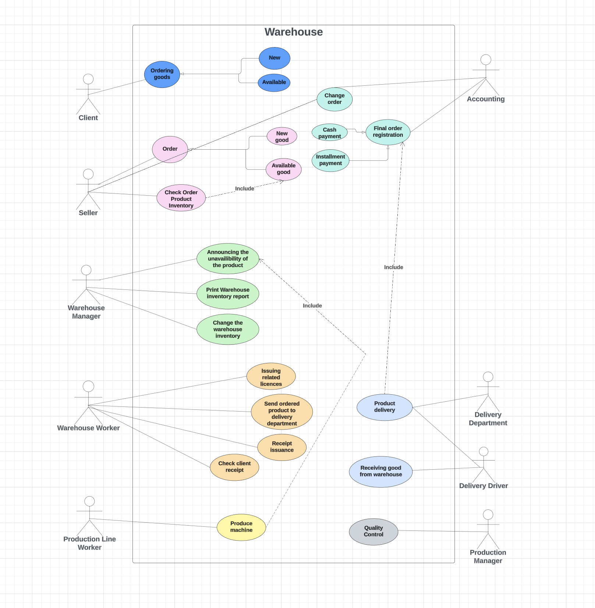
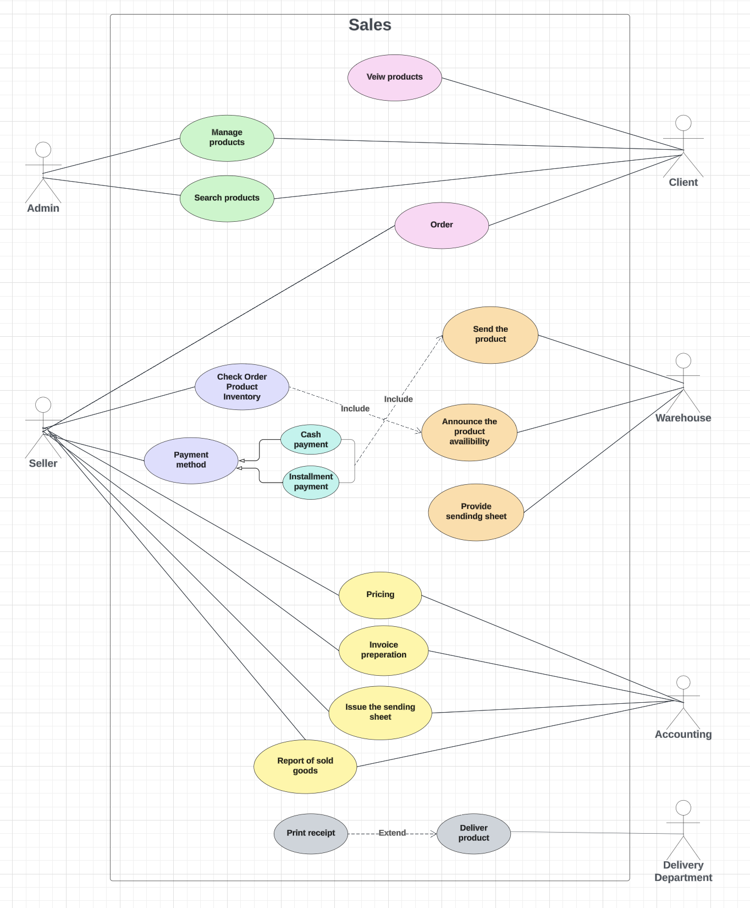
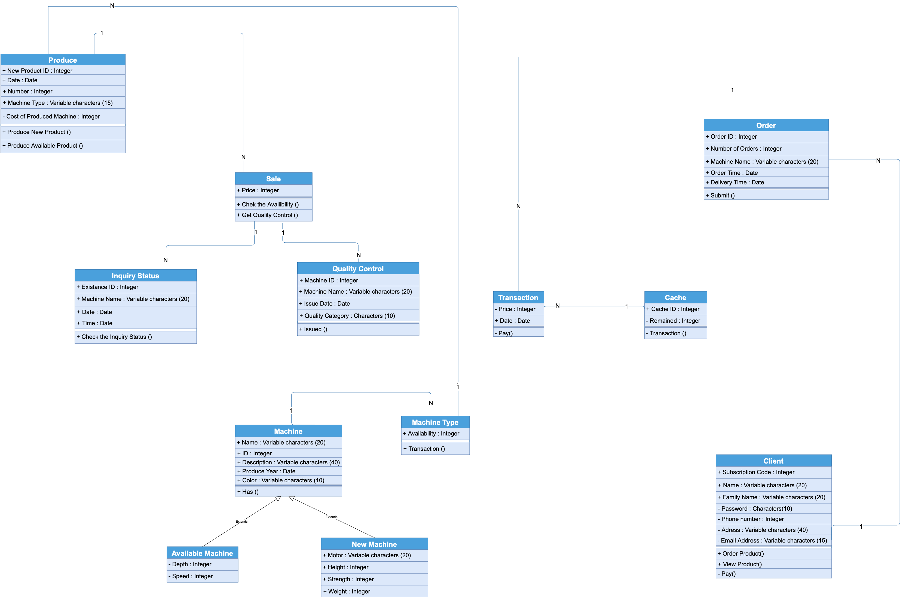
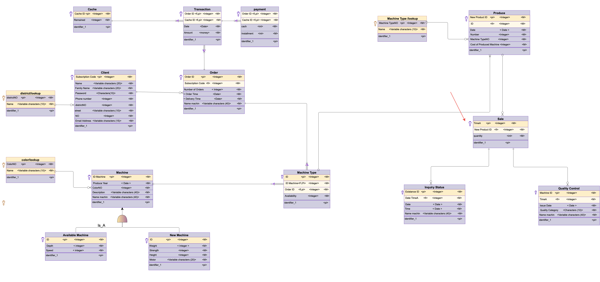
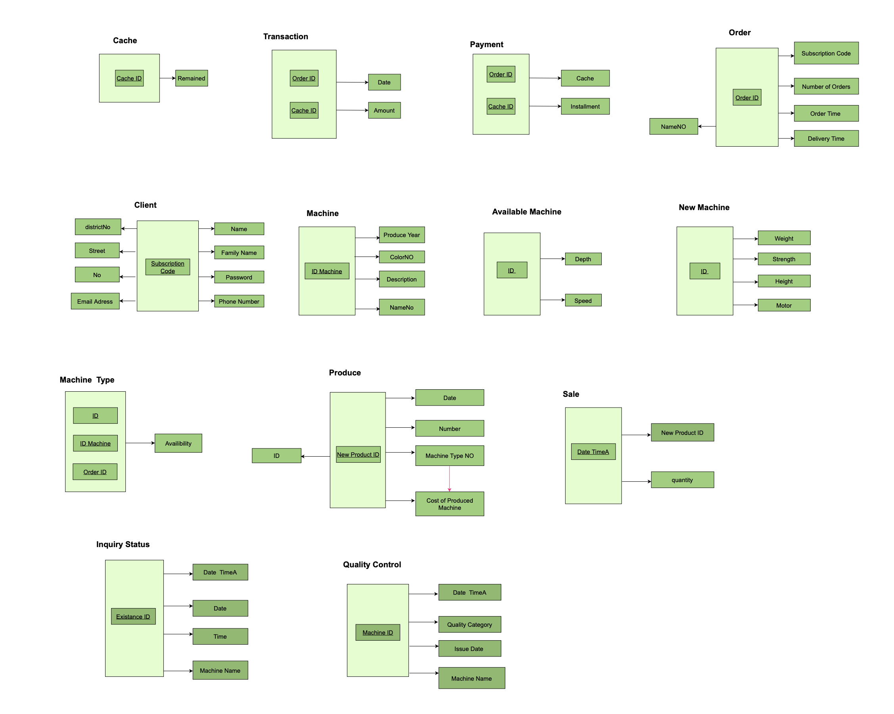
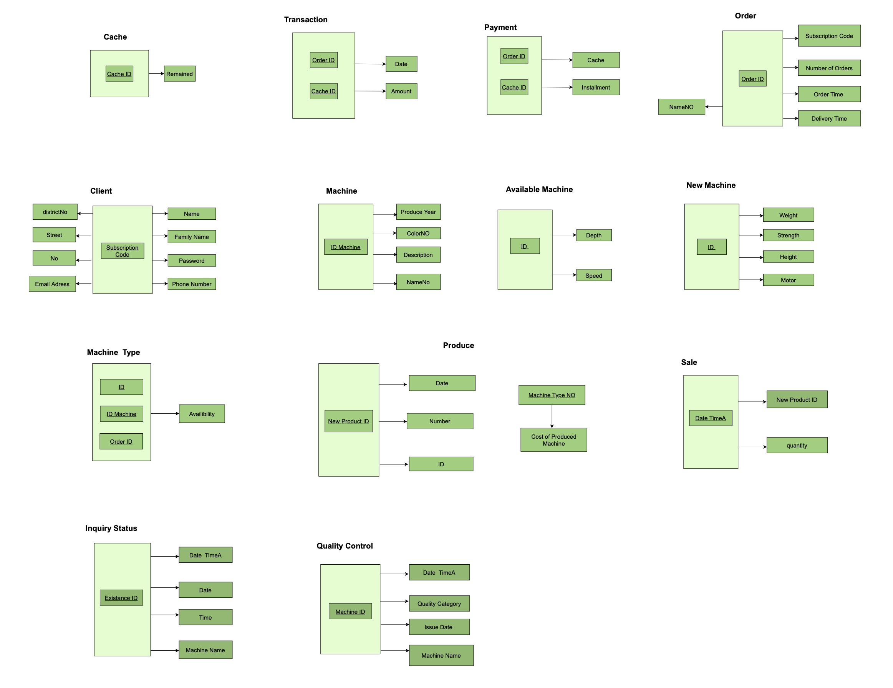

# Agricultural-Industrial-Machinery-Comapny-AIMC-

This project is a dynamic website developed using PHP and PHPMyAdmin for the database part. The website serves as a platform for an Agriculture Industrial Machinery Company to showcase their products and allow customers to browse, add items to their cart, and proceed with transactions. It includes features for both customers and administrators.

## Features

- **Product Showcase:** Display cards for each agricultural machine with relevant information including status, quality control, depth, speed, price, and availability count.
- **Add to Cart:** Customers can add selected machines to their cart for purchase.
- **Shopping Cart:** Customers can view their selected items in the shopping cart, where the total order amount is automatically calculated.
- **User Authentication:** Sign up and login functionalities for users. Users can create an account to access additional features.
- **Role-Based Access Control:** Two defined roles, client and admin, with distinct permissions and functionalities.
- **Admin Dashboard:** Admins have access to the backend of the website, enabling them to manage machine information, add new machines, and delete unavailable machines.
- **Transaction Process:** Seamless payment process with a "pay" button that directs users to a transaction website.
- **Database Structure:** Consists of four tables:
  - Client: Stores information about users including name, email, and address.
  - Machine: Contains details about each agricultural machine such as status, quality control, depth, speed, price, and availability count.
  - Produce: Holds data related to products available for purchase.
  - Transaction: Records transactions made by customers.

## Step-by-Step Design Process

1. **Use Case Diagrams:**
    - **Warehouse Use Case Diagram:**
    &nbsp; &nbsp;
    - **Sale Use Case Diagram:**
     &nbsp; &nbsp;

2. **Class Diagram:**
     &nbsp; &nbsp; 

3. **Logical Data Model (LDM) Diagram:**
     &nbsp; &nbsp; 

4. **Normalization Process:**

4.1 **Before Normalization:**

 &nbsp; &nbsp; 

The database structure before normalization shows redundant data and potential issues with data integrity.

**First Level of Normalization:**

None of the attributes of the relationship has more than one value, and there is no repeating attribute. Therefore, this chart has achieved level 1 normalization.

**Second Level of Normalization:**

The database has achieved a normal level, meaning that all entities have complete functional dependence on all non-key attributes with the main key.

**Third Level of Normalization:**

The database has achieved the second level of normalization, and the attribute is not a determining key.

4.2 **After Normalization:**

 &nbsp; &nbsp; 

The database structure after normalization demonstrates improved data integrity and reduced redundancy.

## Video Tutorials

- [Design Process and Diagrams Overview](https://aparat.com/v/Yzji1) - A comprehensive video explaining the design process, including use case diagrams, class diagrams, and logical data model diagrams.
- [Code and Project Overview](https://aparat.com/v/dlYwf) - In-depth video walkthrough of the codebase and project functionality.

## Team

This project was developed by [Parinaz Shiri](https://github.com/parinaz-shiri) and [Rozhina Ghiasi](https://github.com/Rozh-Zizigoloo/Distributed-Systems-Project).

## Usage

1. **Browse Products:** Visit the website to browse available agricultural machines.
2. **Add to Cart:** Select desired machines and add them to the shopping cart.
3. **View Cart:** Navigate to the shopping cart page to review selected items and the total order amount.
4. **Proceed to Payment:** Click on the "pay" button to initiate the payment process.

## Admin Access

Admins have additional functionalities:

- Access the backend dashboard.
- Modify machine information.
- Add new machines.
- Delete unavailable machines.

## Technologies Used

- PHP
- PHPMyAdmin
- HTML
- CSS
- JavaScript

## Getting Started

To run the project locally, follow these steps:

1. Clone the repository.
2. Set up a local server environment with PHP and MySQL.
3. Import the provided database structure using PHPMyAdmin.
4. Configure the database connection settings in the PHP files.
5. Navigate to the project directory and start the local server.
6. Access the website through a web browser.

## License

This project is licensed under the [MIT License](LICENSE).
